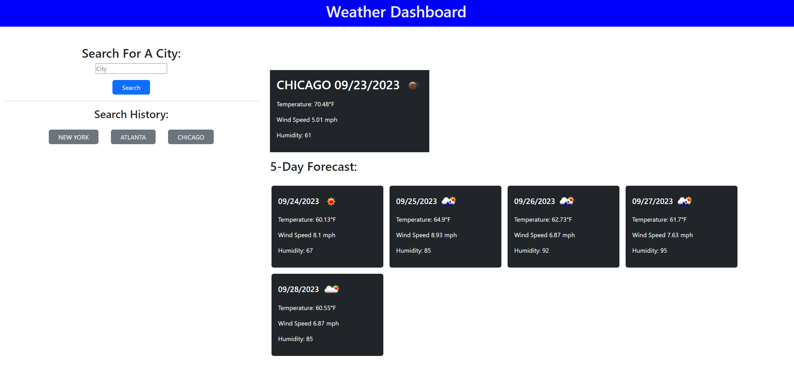

# Weather Dashboard

This app is a weather dashboard which uses a weather api from <https://openweathermap.org/> to display the 1 day and 5 day weather forecasts of any city the user search.
The app will save the user's searches in local storage and create buttons allowing them to revisit the weather data of that city

A live demo of this app can be found at <https://huntermuratore.github.io/weather-dashboard/>

